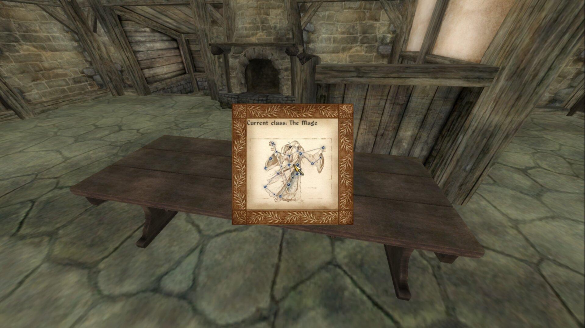

#########################
Birthsign Menu Recreation
#########################

This is a simple recreation of the vanilla birthsign menu. This shows off 3 features:
lists/scrolling, clicking buttons, and manipulating menu/game states in real time.

The important thing to ask when creating a new menu is "what do we need?" For this menu, we will
need:

- List of birthsigns
- Image of current birthsign
- Set player's birthsign
- Title for current birthsign

This is not a lot of aspects, which makes for a pretty simple menu to implement. For simplicity, I
axed the description of the current birthsign. Since all aspects of interactivity are based around
the list of the birthsign, it should be the first thing we need to build.

*********
Menu Root
*********

Before we can display a list, we need to have the structure of a menu to put it into. Generally,
this is referred to as the "menu root", the primary ancestor for all parts of this specific menu.

Since we are only creating a single generic menu, we only need a single XML document. We will create
the file ``Data\Menus\Generic\Kat\BirthsignRemake.xml``.

The first thing we need, thus, is the ``menu`` tile.

Menu Tile
=========

.. code-block:: Xml

   <!-- birthsign.xml -->
   <menu name="BirthsignRemake">
	   <class> &GenericMenu; </class>
	   <stackingtype> &no_click_past; </stackingtype>
	   <locus> &true; </locus>
	   <explorefade> 0.25 </explorefade>
   </menu>

It is useful to add a comment of the file name, but it is not required.

The main trait needed is the ``class`` trait. This tells Oblivion that this is a generic menu, and
is required for any generic menu. The ``stackingtype`` trait is also needed, but is undocumented
behavior. ``locus`` is good to use here, it will easily center the menu to the center of the screen,
and will be the locus for the rest of the document. ``explorefade`` is simply how long we want the
menu to take to fade in. 0.25 is a vanilla value.

We don't need anything more to get this tile working, but nothing will actually render with this
document yet. Lets add a basic ``rect`` to do so.

Rect Tile
=========

As this is a simple menu, we only need one main rect tile. However, there's a bit of a design
dilemma here. We want a menu that looks good, but how do we actually achieve that? We can use
:ref:`prefab documents <PrefabDocuments>` to achieve this. If you look inside the
``Data\Menus\Prefabs`` folder inside ``Oblivion - Misc.bsa``, we can see a collection of XML
documents with specific functions. If you peruse through these documents, you can see how they're
generally built (using user traits). UI mods also provide their own prefab documents as needed. For
now, we just want a basic background, so for that we will used ``generic_background.xml``. Lets take
a look at this prefab real quick.

generic_background.xml
----------------------

When working with prefabs, we want to work with what the prefab is designed to be worked with. That
means using user traits and underscore-prefixed traits only. Let's see what this prefab has:

.. code-block:: Xml

   <!--
   *** IMPORTANT ***
   To set the width and height, use user0 and user1.  This is because the border
   is built around the passed-in values.
   -->
   <user0> 800 </user0>	<!-- menu width -->
   <user1> 500 </user1>	<!-- menu height -->

   <width>
	  <copy src="me()" trait="_rounded_width" />
   </width>
   <height>
	  <copy src="me()" trait="_rounded_height" />
   </height>

   <_tile_size> 1 </_tile_size>                 <!-- repeating length of border elements -->
   <_border_thickness> 44 </_border_thickness>  <!-- thickness of border elements -->

   <_rounded_width>
	  <copy src="me()" trait="user0" />
	  

	  <ceil> 0 </ceil>
	  <mul src="me()" trait="_tile_size" />
   </_rounded_width>
   <_rounded_height>
	  <copy src="me()" trait="user1" />
	  

	  <ceil> 0 </ceil>
	  <mul src="me()" trait="_tile_size" />
   </_rounded_height>

The traits with float values are the only ones we want to touch. These are *designed* to be touched
by the author of this prefab. The 4 traits in this case are: ``user0``, ``user1``, ``_tile_size``,
and ``_border_thickness``. ``user0`` is the width of the menu, while ``user1`` will be the height.
The other 2 traits are pretty self-explanatory.

Implementing the Prefab
=======================

.. code-block:: Xml

    <rect name="bmr_background">
        <include src="generic_background.xml" />
        <visible> &true; </visible>
        <id> 100 </id>
        <depth> 0 </depth>
        <locus> &true; </locus>
        <target> &false; </target>
		<user0> 800 </user0>
		<user1> 500 </user1>
        <x>
            <copy src="screen()" trait="width" />
            
            
 2 

        </x>
        <y>
            <copy src="screen()" trait="height" />
            
            
 2 

        </y>
    </rect>

For the ``x``  and the ``y`` positions, we can use :ref:`selectors <Selectors>` to grab screen data
and the current width and height of the menu to automatically center the menu. Selectors require a
source trait to copy from. Since ``x`` and ``y`` position are the leftmost and topmost pixels of the
tiles, we need this position to be centerable. Simply dividing the screen dimensions in half will
not do, as that would imply that ``x`` and ``y`` positions are based on the *center* of the tile. To
get around this, we subtract out the dimensions of the tile. This essentially shifts the "center" of
the tile up and to the left, allowing it to appear centered in the screen.

Since we don't have any other tile or functionality, we can just have leave this as is. We can even
render this tile. So lets fire up Construction Set Extender. For our own simplicity, we will simply
launch a menu with a button, so let us create a cell with a button it:

   As this is a test, we don't need much complication here. An activator is a quick way to test our
   menu out.

It is useful to handle large functionality in object scripts with a user-defined function, so for
the button's script we simply call a main menu function:

::

   scn BMRActivator
   Begin OnActivate
	   Call BMRFunction
   End

::

   scn BMRFunction
   Begin Function{}
	   ;; Create menu using GMF
	   Call GMFShowMenu "kat\birthsignremake.xml" 0
   End

Saving these scripts, and setting our button's object script to ``BMRActivator``, when we ``coc
BMRCell`` in game, we should have a functioning menu:

   Notice that despite the 1920x1080 image, the 800x500 menu does not scale accurately. This is a
   side effect of UI rendering based on its internal parameters.

Congrats! You have created a generic menu. Now we need to fill out all the details.

Displaying Current Birthsign
============================

Looking back to our list of features, lets work out what depends on what.

- List of birthsigns
- Image of current birthsign
- Set player's birthsign
- Title for current birthsign

The list of birthsigns is pretty independent. The image and title of the current birthsign only
depends upon the player's birthsign. Setting the player's birthsign depends upon the list. Since the
image and title is dependent upon the player's current status, we can start there.

We would need 2 tiles for the title and image:

.. code-block:: Xml

   <!-- birthsign.xml -->
   <menu name="BirthsignRemake">
	   <class> &GenericMenu; </class>
	   <stackingtype> &no_click_past;
	   <locus> &true; </locus>
	   <explorefade> 0.25 </explorefade>

	   <rect name="bmr_background">
		   <include src="generic_background.xml" />
		   <visible> &true; </visible>
		   <id> 100 </id>
		   <depth> 0 </depth>
		   <locus> &true; </locus>
		   <target> &true; </target>
		   <user0> 800 </user0>
		   <user1> 500 </user1>
		   <user0>
			   <copy> 0 </copy>
			   <add src="bmr_background_image" trait="width" />
			   <add> 10 </add>
		   </user0>
		   <user1>
			   <copy> 0 </copy>
			   <add src="bmr_background_image" trait="height" />
			   <add> 10 </add>
		   </user1>
		   <x>
			   <copy src="screen()" trait="width" />
			   
			   
 2 

		   </x>
		   <y>
			   <copy src="screen()" trait="height" />
			   
			   
 2 

		   </y>

		   <image name="bmr_background_image">
			   <target> &false; </target>
			   <locus> &true; </locus>
			   <filename> Menus\Birthsign\Birthsign_The Warrior.dds </filename>
			   <id> 110 </id>
			   <depth> 3 </depth>
			   <zoom> &scale; </zoom>
			   <height> 256 </height>
			   <width> 256 </width>
			   <x> 0 </x>
			   <y> 60 </y>
		   </image>

		   <text name="bmr_class_name">
			   <id> 111 </id>
			   <string> Current class: The Warrior </string>
			   <depth> 3 </depth>
			    3 
			   <red> 0 </red>
			   <green> 0 </green>
			   <blue> 0 </blue>
			   <alpha> 200 </alpha>
			   <visible> &true; </visible>
			   <locus> &false; </locus>
		   </text>

	   </rect>
   </menu>

There's, a lot, going on here.

Image Tile
----------

The image tile ``bmr_background_image`` is where we are going to render out the current class image.
As this is an image tile, we need to be very specific as to how this gets render.

First, we use a fallback image for the ``filename`` trait, in this case just the Warrior birthsign
image.

Second, since we are using images with all the same sizes, the zoom value becomes less of a concern.
For birthsigns, all the texture sizes are ``512x512``, which is clearly too big for our desired menu
(less than ``800x500``). However, a feature of the ``zoom`` trait is that it can take the
``&scale;`` entity in which the zoom value will be automatically adjusted to fit the confines of the
height and width of the tile.

Third, we need to actually define the confines of the texture. As ``512x512`` was simply too big,
``256x256`` will suffice.

Text Tile
---------

This tile is a bit simpler, as it is just a text tile. Since we can't set the ``width``  and
``height`` traits, we will use fonts for the specific sizes we want. We can see the system possible
fonts within ``Oblivion.ini``. For example with a vanilla game:

.. code-block:: Ini

   [Fonts]
   SFontFile_1=Data\Fonts\Kingthings_Regular.fnt
   SFontFile_2=Data\Fonts\DarN_Kingthings_Petrock_14.fnt
   SFontFile_3=Data\Fonts\DarN_Kingthings_Petrock_16.fnt
   SFontFile_4=Data\Fonts\DarN_Oblivion_28.fnt
   SFontFile_5=Data\Fonts\Handwritten.fnt

While there are no hardset rules for font naming schemes, generally un-numbered fonts are between 12
and 14 point (which again gets scaled from menu coordinates to your screen's coordinates). Generally
the first font file is used for most UI elements, but there are no hardset rules. We will use font 3
here.

Since ``width`` and ``height`` traits are read only, we just have to assume that the text can fit
inside the width we wanted for this tile. Therefore, including a default ``string``  value is still
useful here.

Color should also be imported from other values, as Oblivion does not actually use black text.

.. figure:: images/birthsign-image-text.jpg
   :align: center

   Functioning menu

Scripting Current Birthsign
---------------------------

Of course, we do actually want the menu to *do* something, so lets add in the scripting.

The beauty of basic tiles like text and images means we don't need to do much to change these
values:

::

   scn BMRFunction
   ref rBirthsign
   string_var sBirthsign
   Begin Function{}
	   Let rBirthsign := GetPlayerBirthsign
	   Let sBirthsign := GetName rBirthsign
	   ;; Create menu using GMF
	   Call GMFShowMenu "kat\birthsignremake.xml" 0
	   Call GMFSetTileStringValue "bmr_background\bmr_class_name" "string" ("Current class: " + sBirthsign)
	   Call GMFSetTileStringValue "bmr_background\bmr_background_image" "filename" ("Menus\Birthsign\Birthsign_" + sBirthsign + ".dds")

	   ;; PLEASE DESTRUCT UNNEEDED STRINGS
	   sv_Destruct sBirthsign
   End

We only need to touch the appropriate string values of the two tiles. That's it. With :ref:`a setter
function <ValueFunctions>` this is pretty straightforward too.

   Current birthsign is now shown.

***************
Creating A List
***************

Historically, adding a list to a menu has been the most complicated and unknown part of Oblivion
menus. GenericMenuFramework fortunately makes this simpler. What we need is a ``rect`` that will
hold our list.

.. code-block:: Xml

   <menu name="BirthsignRemake">
	   <class> &GenericMenu; </class>
	   <stackingtype> &no_click_past; </stackingtype>
	   <locus> &true; </locus>
	   <explorefade> 0.25 </explorefade>

	   <rect name="bmr_background">
		   <include src="generic_background.xml" />
		   <visible> &true; </visible>
		   <id> 100 </id>
		   <depth> 0 </depth>
		   <locus> &true; </locus>
		   <target> &true; </target>
		   <user0>
			   <copy> 0 </copy>
			   <add src="bmr_background_image" trait="width" />
			   <add src="bmr_info_box" trait="width" />
			   <add> 10 </add>
		   </user0>
		   <user1>
			   <copy> 0 </copy>
			   <add src="bmr_background_image" trait="height" />
			   <add> 10 </add>
		   </user1>
		   <x>
			   <copy src="screen()" trait="width" />
			   
			   
 2 

		   </x>
		   <y>
			   <copy src="screen()" trait="height" />
			   
			   
 2 

		   </y>

		   <image name="bmr_background_image">
			   <target> &true; </target>
			   <locus> &true; </locus>
			   <filename> Menus\Birthsign\Birthsign_The Warrior.dds </filename>
			   <id> 110 </id>
			   <depth> 3 </depth>
			   <zoom> &scale; </zoom>
			   <height> 256 </height>
			   <width> 256 </width>
			   <x> 0 </x>
			   <y> 60 </y>
		   </image>

		   <text name="bmr_class_name">
			   <id> 111 </id>
			   <string> Current class: The Warrior </string>
			   <depth> 3 </depth>
			    3 
			   <red> 0 </red>
			   <green> 0 </green>
			   <blue> 0 </blue>
			   <alpha> 200 </alpha>
			   <visible> &true; </visible>
			   <locus> &false; </locus>
		   </text>

		   <rect name="bmr_info_box" >
			   <target> &true; </target>
			   <height> <copy src="bmr_background" trait="height" /> </height>
			   <width> <copy src="bmr_background_image" trait="width" /> </width>
			   <x> <copy src="bmr_background_image" trait="width" /> </x>
			   <y> 0 </y>

			   <text name="bmr_title" >
				   <id> 121 </id>
				   <visible> &true; </visible>
				   <string> Choose your birthsign </string>
				   <depth> 3 </depth>
				    3 
				   <red> 0 </red>
				   <green> 0 </green>
				   <blue> 0 </blue>
				   <alpha> 200 </alpha>
				   <visible> &true; </visible>
				   <locus> &true; </locus>
				   <target> &false; </target>
				   <wrapwidth> <copy src="parent()" trait="width" /> </wrapwidth>
				   <x>
					   <copy src="parent()" trait="x" />
					   <add> 5 </add>
				   </x>
				   <y> 0 </y>
			   </text>

			   <image name="bmr_scroll_bar">
				   <include src="vertical_scroll.xml"/>
				   <target> &true; </target>
				   <depth> 4 </depth>
				   <id> 122 </id>
				   <x>
					   <copy src="bmr_info_box" trait="x" />
					   <add src="bmr_info_box" trait="width" />
					    10 
				   </x>
				   <y> 36 </y>
				   <height>
					   <copy src="bmr_info_box" trait="height" />
					    61 
				   </height>
				   <user1> 0 </user1>
				   <user2>
					   <copy src="bmr_info_list_box" trait="child_count" />
					    <!-- remove the viewable items -->
					   <add> 2 </add>
				   </user2>
				   <user3> 1 </user3>
				   <user4> 6 </user4>
				   <user5> 0 </user5>
				   <user6> 33 </user6>
				   <user8> 8 </user8>
			   </image>

			   <rect name="bmr_info_list_box">
				   <id> 123 </id>
				   <depth> 5 </depth>
				   <alpha> 0 </alpha>
				   <locus> &false; </locus>
				   <x> <copy src="bmr_background_image" trait="width" /> </x>
				   <height>
					   240
				   </height>
				   <y>
					   <copy> 0 </copy>
					   <add>
						   <copy src="bmr_title" trait="height" />
					   </add>
				   </y>
				   <target> &false; </target>
				   <xdefault> &true; </xdefault>
				   <xlist> &xlist; </xlist>
				   <xscroll> <ref src="bmr_scroll_bar" trait="user5" /> </xscroll>
			   </rect>
		   </rect>
	   </rect>

	   <template name="bmr_list_template">
		   <rect name="bmr_list_item">
			   <depth> 6 </depth>
			   <id> 200 </id>
			   <target> &true; </target>
			   <repeatvertical> &true; </repeatvertical>
			   <alpha> 0 </alpha>
			   <width> 600 </width>
			   <height> 36 </height>
			   <clips> &true; </clips>
			   <locus> &true; </locus>
			   <x> <copy src="bmr_background_image" trait="width" /> </x>
			   <y>
				   <copy> 36 </copy>
				   <mul>
					   <copy src="me()" trait="listindex" />
					   
				   </mul>
				   <add> 36 </add>
			   </y>
			   <listclip>
				   <copy src="me()" trait="listindex"/>
				   <gte>
					   <copy src="bmr_scroll_bar" trait="user7"/>
					   <add src="bmr_scroll_bar" trait="user8"/>
					    2 
				   </gte>
				   <or>
					   <copy src="me()" trait="listindex"/>
					   <lt src="bmr_scroll_bar" trait="user7"/>
				   </or>
			   </listclip>
			   <clicksound> 1 </clicksound>
			   <listindex> 0 </listindex>
			   <user1> </user1>
			   <xdefault> &false; </xdefault>
			   <xlist> &xitem; </xlist>
			   <xup> &prev; </xup>
			   <xdown> &next; </xdown>

			   <xscroll>
				   <copy src="me()" trait="listindex" />
				   
					   <copy src="bmr_scroll_bar" trait="user8"/>
					   
 2 

					   <ceil> 0 </ceil>
				   
				   <add> 1 </add>
			   </xscroll>

			   <text name="bmr_list_name" >
				   <depth> 8 </depth>
				   <string> <copy src="parent()" trait="user1" /> </string>
				   <justify> &left; </justify>
				    3 
				   <red> 0 </red>
				   <green> 0 </green>
				   <blue> 0 </blue>
				   <alpha> 200 </alpha>
				   <wrapwidth> 475 </wrapwidth>
				   <wraplines> 1 </wraplines>
				   <clips> &true; </clips>
				   <x> 5 </x>
				   <y>
					   <copy> 16 </copy>
					   
						   <copy src="me()" trait="height" />
						   
 2 

					   
				   </y>
			   </text>

			   <rect name="bmr_list_focus">
				   <include src="darn\focus_box.xml"/>
				   <depth> 7 </depth>
				   <visible>
					   <copy src="parent()" trait="mouseover" />
					   <eq> 1 </eq>
				   </visible>
				   <y> 5 </y>
				   <width>
					   <copy src="bmr_list_name" trait="width" />
					   <add> 15 </add>
				   </width>
				   <height> 22 </height>
			   </rect>
		   </rect>
	   </template>
   </menu>

There's a lot to handle here. A list isn't just a single component, it is pretty encompassing. The
actual list ``rect`` is "bmr_info_list_box", but this list itself contained in another rect
"bmr_info_box". This is done to be able to move around the entire list "object", scroll bar, title,
and any other UI elements, all at the same time. As well, it is much simpler to only manipulate a
dedicated list element.

The template is the UI element for **every** list item. GenericMenuFramework will insert these one
at a time, allowing for side-effects to happen when each list item is inserted.

``bmr_info_box``
================

.. code-block:: Xml

   <rect name="bmr_info_box" >
	  <target> &true; </target>
	  <height> <copy src="bmr_background" trait="height" /> </height>
	  <width> <copy src="bmr_background_image" trait="width" /> </width>
	  <x> <copy src="bmr_background_image" trait="width" /> </x>
	  <y> 0 </y>
   </rect>

This ``rect`` contains all of our list related UI elements. Since we are creating a one feature
menu, let's just make the list the same size as ``bmr_background_image``. The Y-position doesn't
need to move, but the X-position should simply be the width of ``bmr_background_image`` to offset
this ``rect``.

Inside are 3 tiles:

``bmr_title``
-------------

.. code-block:: Xml

   <text name="bmr_title" >
	  <id> 121 </id>
	  <visible> &true; </visible>
	  <string> Choose your birthsign </string>
	  <depth> 3 </depth>
	   3 
	  <red> 0 </red>
	  <green> 0 </green>
	  <blue> 0 </blue>
	  <alpha> 200 </alpha>
	  <visible> &true; </visible>
	  <locus> &true; </locus>
	  <target> &false; </target>
	  <wrapwidth> <copy src="parent()" trait="width" /> </wrapwidth>
	  <x>
		   <copy src="parent()" trait="x" />
		   <add> 5 </add>
	  </x>
	  <y> 0 </y>
   </text>

We should notify the user as to what this list does. This is a basic ``text`` tile that does this.

``bmr_scroll_bar``
------------------

.. code-block:: Xml

   <image name="bmr_scroll_bar">
	  <include src="vertical_scroll.xml"/>
	  <target> &true; </target>
	  <depth> 4 </depth>
	  <id> 122 </id>
	  <x>
		 <copy src="bmr_info_box" trait="x" />
		 <add src="bmr_info_box" trait="width" />
		  10 
	  </x>
	  <y> 36 </y>
	  <height>
		 <copy src="bmr_info_box" trait="height" />
		  61 
	  </height>
	  <user1> 0 </user1>
	  <user2>
		 <copy src="bmr_info_list_box" trait="child_count" />
		  <!-- remove the viewable items -->
		 <add> 2 </add>
	  </user2>
	  <user3> 1 </user3>
	  <user4> 6 </user4>
	  <user5> 0 </user5>
	  <user6> 33 </user6>
	  <user8> 8 </user8>
   </image>

The scroll bar is fairly complex, requiring a lot to it. The traits here, while sometimes clear, are
particular:

:x: The right edge of the top arrow
:y: The position where the top arrow begins
:height: Distance between the two arrows, not to the tips
:user1: Minimum scrollable value, which should be 0 here
:user2: Maximum scrollable value, controls scroll-off amount
:user3: Amount to scroll when arrow is clicked
:user4: Amount to scroll when bar is clicked
:user5: Starting value of scroll bar. Leave at 0
:user6: ID for scroll bar marker
:user7: Do not set, reads scroll position
:user8: Amount of visible items

However, this is all this tile needs to get scrolling working in this document.

``bmr_info_list_box``
---------------------

.. code-block:: xml

   <rect name="bmr_info_list_box">
	  <id> 123 </id>
	  <depth> 5 </depth>
	  <alpha> 0 </alpha>
	  <locus> &false; </locus>
	  <x> <copy src="bmr_background_image" trait="width" /> </x>
	  <height> 240 </height>
	  <y>
		 <copy> 0 </copy>
		 <add> <copy src="bmr_title" trait="height" /> </add>
	  </y>
	  <target> &false; </target>
	  <xdefault> &true; </xdefault>
	  <xlist> &xlist; </xlist>
	  <xscroll> <ref src="bmr_scroll_bar" trait="user5" /> </xscroll>
   </rect>

This ``rect`` is where we will place our list. The position is mostly the parent ``rect``, but
shifted down by the height of ``bmr_title``.

We **need** the following traits however:

:target: Set to ``&false;``, this isn't being targeted
:xdefault: Set to ``&true;``
:xlist: Set to ``&xlist;``, this tells the engine that this tile contains a list
:xscroll: Set to the ``user5`` of your scroll bar, in this case we are setting to
		  ``bmr_scroll_bar``. This tells the engine what scroll bar this list is attached to.

``bmr_list_template``
=====================

.. code-block:: Xml

	<template name="bmr_list_template">
	</template>

This is a template. All templates must be the last elements in the XML document. Templates are used
to inject into tiles during run-time. In this case, this template is used for list elements. The
template has **no** traits, it only contains other valid non-template tiles.

``bmr_list_item``
-----------------

.. code-block:: Xml

   <rect name="bmr_list_item">
	  <depth> 6 </depth>
	  <id> 200 </id>
	  <target> &true; </target>
	  <repeatvertical> &true; </repeatvertical>
	  <alpha> 0 </alpha>
	  <width> 600 </width>
	  <height> 36 </height>
	  <clips> &true; </clips>
	  <locus> &true; </locus>
	  <x> <copy src="bmr_background_image" trait="width" /> </x>
	  <y>
		 <copy> 36 </copy>
		 <mul>
			<copy src="me()" trait="listindex" />
			
		 </mul>
		 <add> 36 </add>
	  </y>
	  <listclip>
		 <copy src="me()" trait="listindex"/>
		 <gte>
			<copy src="bmr_scroll_bar" trait="user7"/>
			<add src="bmr_scroll_bar" trait="user8"/>
			 2 
		 </gte>
		 <or>
			<copy src="me()" trait="listindex"/>
			<lt src="bmr_scroll_bar" trait="user7"/>
		 </or>
	  </listclip>
	  <clicksound> 1 </clicksound>
	  <listindex> 0 </listindex>
	  <user1> </user1>
	  <xdefault> &false; </xdefault>
	  <xlist> &xitem; </xlist>
	  <xup> &prev; </xup>
	  <xdown> &next; </xdown>

	  <xscroll>
		 <copy src="me()" trait="listindex" />
		 
			<copy src="bmr_scroll_bar" trait="user8"/>
			
 2 

			<ceil> 0 </ceil>
		 
		 <add> 1 </add>
	  </xscroll>
   </rect>

This is the primary ``rect`` for each list item. It needs some specific traits beyond
appearance/functionality to work as a list item:

:id: Needs an ID. You do not need to worry about unique IDs for each list item, but an ID is needed.
:target: Set to ``&true;``, needed to enable scrolling and clicking.
:repeatvertical: Set to ``&true;``, needed for lists.
:clips:  Set to ``&true;``, needed to hide value items outside of scroll range.
:listclip: This sets the amount of values that are removed from view. What is needed is for the
		   current listindex to be between the current scroll value and the maximum possible value
		   or below the scroll value. The settings here should work for most cases.
:listindex: Set to 0, the index for the list item.
:xdefault: Set to ``&false;``.
:xlist: Set to ``&xitem;``, this tells the engine that this tile is an item for a list.
:xup: Set to ``&prev;`` to go to the previous list item.
:xdown: Set to ``&next;`` to go to the next list item.
:xscroll: This controls how far the list item moves when scrolling. The idea is that this should
		  scroll no more than the possible viewable value. The settings here should work for most
		  cases.

Inside are 2 more tiles:

``bmr_list_name``
^^^^^^^^^^^^^^^^^

.. code-block:: Xml

   <text name="bmr_list_name" >
	  <depth> 8 </depth>
	  <string> <copy src="parent()" trait="user1" /> </string>
	  <justify> &left; </justify>
	   3 
	  <red> 0 </red>
	  <green> 0 </green>
	  <blue> 0 </blue>
	  <alpha> 200 </alpha>
	  <wrapwidth> 475 </wrapwidth>
	  <wraplines> 1 </wraplines>
	  <clips> &true; </clips>
	  <x> 5 </x>
	  <y>
		 <copy> 16 </copy>
		 
			<copy src="me()" trait="height" />
			
 2 

		 
	  </y>
   </text>

This block is just the text for the list. For convenience, we set the ``string`` trait to the
``user1`` trait of its parent tile for ease of use. There is nothing special about this tile
otherwise.

``bmr_list_focus``
^^^^^^^^^^^^^^^^^^

.. code-block:: Xml

   <rect name="bmr_list_focus">
	  <include src="darn\focus_box.xml"/>
	  <depth> 7 </depth>
	  <visible>
		 <copy src="parent()" trait="mouseover" />
		 <eq> 1 </eq>
	  </visible>
	  <y> 5 </y>
	  <width>
		 <copy src="bmr_list_name" trait="width" />
		 <add> 15 </add>
	  </width>
	  <height> 22 </height>
   </rect>

This ``rect`` provides a focus box for the list items when there's a mouseover event for it. We use
a prefab for this, which does most of the work. The main thing here is that the ``visible`` trait
needs to compare to 1 to determine if it should be visible or not.

.. _scriptingthelist:

Scripting the List
==================

Now that we have the basics of the menu, we need to hook up all the scripting. Fortunately this is
pretty simple overall.

For the main function script, we don't need to add much:

::

   scn BMRFunction
   ref rBirthsign
   string_var sBirthsign
   array_var aBirthsigns
   ref rFunction
   Begin Function{}
	   ;; Set up birthsign information
	   Let rBirthsign := GetPlayerBirthsign
	   Let sBirthsign := GetName rBirthsign
	   let aBirthsigns := ar_Construct array
	   ar_Append aBirthsigns BirthSignApprentice
	   ar_Append aBirthsigns BirthSignAtronach
	   ar_Append aBirthsigns BirthSignLord
	   ar_Append aBirthsigns BirthSignLover
	   ar_Append aBirthsigns BirthSignMage
	   ar_Append aBirthsigns BirthSignRitual
	   ar_Append aBirthsigns BirthSignSerpent
	   ar_Append aBirthsigns BirthSignShadow
	   ar_Append aBirthsigns BirthSignSteed
	   ar_Append aBirthsigns BirthSignThief
	   ar_Append aBirthsigns BirthSignTower
	   ar_Append aBirthsigns BirthSignWarrior

	   ;; Create menu using GMF
	   Call GMFShowMenu "kat\birthsignremake.xml" 400
	   Call GMFSetTileStringValue "bmr_background\bmr_class_name" "string" ("Current class: " + sBirthsign)
	   Call GMFSetTileStringValue "bmr_background\bmr_background_image" "filename" ("Menus\Birthsign\Birthsign_" + sBirthsign + ".dds")

	   ;; Populate List
	   Let rFunction := BMRSetListText
	   Call GMFInsertArrayList "bmr_background\bmr_info_box\bmr_info_list_box" "bmr_list_template" aBirthsigns rFunction
   End

We only add 1 extra function call from GenericMenuFramework, which is the list function, but we also
need to pass a function along with it. The function ``GMFInsertArrayList`` needs to pass the tile we
want to have the list, the template, the 0-indexed array, and an optional side-effect function.
Without this side-effect function, this function will just display garbage but *will* insert the
amount of items we wanted. We need the side-effect function to at least display text.

::

	scn BMRSetListText
	string_var sTile
	array_var aList
	int iIndex
	string_var sText
	string_var sTrueTile
	ref rTempRef
	Begin Function {sTile, aList, iIndex}
		;; Normalize list index tile name
		Let sTrueTile := sTile + "\" + $iIndex
		Let rTempRef := aList[iIndex]
		;; Render name of reference
		Let sText := GetName rTempRef
		Call GMFSetTileStringValue sTrueTile "user1" sText
	End

Since we just need to add the name of the birthsign to the list item's text tile, this function is
absurdly simple. We get the current birthsign from the passed array and index, then we set the
``user1`` of ``bmr_list_box``.

But this is called differently. For other tile manipulations, we normally just pass a variable such
as ``sTile``, but that's not what's happening here. Since list items are iterated over, they are
indexed inside the menu that's rendered. Therefore the first list item is ``bmr_info_list_box/0``.
Notice how we don't use ``bmr_list_box`` here. This is *not* a bug but intentional behavior. If we
use ``tile_GetInfo`` on ``sTrueTile`` to count its children then it will return 2, for
``bmr_list_name`` and ``bmr_list_focus``.

We now have a menu with a list populated!

   We have a working list.

   We can even highlight items with our mouse.

That was a lot of work, but the hardest part was done. Congrats, you've uncovered one of the hardest
aspects of Oblivion menus. But we are far from done. We need 2 more things, scrolling and making the
list update the player's birthsign. Both are fairly simple so lets just go with that order.

****************
Scrolling A List
****************

Scrolling a list, even more difficult than creating a list historically, is one of the simplest
parts of GenericMenuFramework. We need 2 things, a quest script in order to run the needed functions
continuously and an array of IDs to target for scrolling. Dragging the scroll marker will also be
included here, since it is even simpler to handle.

Quest Script
============

Quest scripts in Oblivion function as "global" scripts. Since quest objects are always in memory,
their associated scripts are always in memory. We can use this for input behavior in this case. As
well, since quest scripts are always in memory, we can use them as a namespace for variables. Both
will features will be in use here.

::

   scn BMRScript
   float fQuestDelayTime
   string_var sActiveTile
   array_var aIDs
   Begin MenuMode 1011
	   Let fQuestDelayTime := 0.001
	   Let sActiveTile := GetActiveUIComponentName
	   if eval sv_Compare "bmr_background" sActiveTile > -2
		   ;; DRAGGING -- takes tile to be dragged
		   Call GMFOnDragInitFunction "bmr_background\bmr_info_box\bmr_scroll_bar"
		   ;; SCROLLING -- takes tile to be dragged, as well as array of IDs
		   Call GMFOnScrollVerticalInitFunction "bmr_background\bmr_info_box\bmr_scroll_bar" aIDs
	   endif
	   ;; WARN: Remember to destruct your strings!!
	   sv_Destruct sActiveTile
   End

For clarity, the quest script's ID is going to be ``BMR``.

This is a pretty basic script. Since this plugin is only focused upon creating a new generic menu,
we can use a ``Begin MenuMode 1011`` block, with 1011 being the ID for generic menus. We still want
to check if we are in *our* menu, but we can do that with a quick check using
``GetActiveUIComponentName`` and seeing if our root menu ``rect`` ``bmr_background`` is found in the
active tile (active tile meaning the tile the mouse is focused on). ``sv_Compare`` returns weird
results, but we are basically asking "is our compared string found *anywhere* inside the active
tile".

Inside this check, we have two calls: ``GMFOnDragInitFunction`` and
``GMFOnScrollVerticalInitFunction``. The first function just takes the scroll bar you want to be
able to drag. The second function takes the scroll bar you want to scroll **and** an array of IDs
that you want the scrolling to be active for. We need to set up this array, and we can do this
within ``BMRFunction``.

Adding ID Array
===============

Since we declared the variable for the array in the quest script, we can easily access them in
``BMRFunction``.

::

   scn BMRFunction
   ref rBirthsign
   string_var sBirthsign
   array_var aBirthsigns
   ref rFunction
   Begin Function{}
	   ;; Add IDs to passing array
	   Let BMR.aIDs := ar_Construct array
	   ar_Append BMR.aIDs 33		;vertical_scroll_marker
	   ar_Append BMR.aIDs 100		;bmr_background
	   ar_Append BMR.aIDs 120		;bmr_info_box
	   ar_Append BMR.aIDs 122		;bmr_scroll_bar
	   ar_Append BMR.aIDs 123		;bmr_info_list_box
	   ar_Append BMR.aIDs 200		;bmr_list_item

	   ;; Set up birthsign information
	   Let rBirthsign := GetPlayerBirthsign
	   Let sBirthsign := GetName rBirthsign
	   let aBirthsigns := ar_Construct array
	   ar_Append aBirthsigns BirthSignApprentice
	   ar_Append aBirthsigns BirthSignAtronach
	   ar_Append aBirthsigns BirthSignLord
	   ar_Append aBirthsigns BirthSignLover
	   ar_Append aBirthsigns BirthSignMage
	   ar_Append aBirthsigns BirthSignRitual
	   ar_Append aBirthsigns BirthSignSerpent
	   ar_Append aBirthsigns BirthSignShadow
	   ar_Append aBirthsigns BirthSignSteed
	   ar_Append aBirthsigns BirthSignThief
	   ar_Append aBirthsigns BirthSignTower
	   ar_Append aBirthsigns BirthSignWarrior

	   ;; Create menu using GMF
	   Call GMFShowMenu "kat\birthsignremake.xml" 400
	   Call GMFSetTileStringValue "bmr_background\bmr_class_name" "string" ("Current class: " + sBirthsign)
	   Call GMFSetTileStringValue "bmr_background\bmr_background_image" "filename" ("Menus\Birthsign\Birthsign_" + sBirthsign + ".dds")

	   ;; Populate List
	   Let rFunction := BMRSetListText
	   Call GMFInsertArrayList "bmr_background\bmr_info_box\bmr_info_list_box" "bmr_list_template" aBirthsigns rFunction

	   ;; WARN: Remember to destruct strings
	   sv_Destruct sBirthsign
   End

In here, we insert the IDs we want to control to the namespaced ``aIDs``. Each of these IDs are
basically all the IDs we have, but if you want you can control these finer. It is also helpful to
label what each ID is.

Now, since we call ``ar_Construct`` each time we call this function, and we call this function with
an activator, ``BMR.aIDs`` is always recreated. Just remember this when you're dealing with arrays.
But with this in mind, you should be able to scroll with a mouse wheel and by dragging the scroll
bar marker. Also, as a side effect of everything we've previously set up with the XML document we
can also use the arrow keys (or controller) to navigate the list with scrolling.

None of this was painful now was it?

*****************
Setting Birthsign
*****************

Now that we have scrolling working, let's make the menu actually do what want it to do: set the
player's birthsign.

This is where things become more complicated from a programmer's perspective. See, we need to be
able to both display the birthsign name *and* set the player's birthsign. But there's a loss of
information when we get the name of a object. It is functionally impossible to go from an object's
name to an object's editorID. So what do we do? For this, we need a deeper understanding of how
Oblivion stores objects.

EditorIDs & FormIDs
===================

Objects in Oblivion are literally everything. Every quest, script, item, NPC, etc... is an object.
There are two ways to express the unique tokens for each object, the "editorID" and the "formID"
(typically referred to as a form).

:EditorID: An alphanumerical string of characters with no spaces or special characters. There's no
		   limit past the lack of special characters.
:FormID: A hexadecimal number, with the first 2 characters being optional. The first 2 characters
		 are the hexadecimal index of the plugin, and thus not static. Thus we have a 6 bit object
		 limit for every plugin.

Despite being able to see both of these pretty much everywhere, from vanilla Construction Set to the
extender to the game itself, you **cannot** use formIDs easily anywhere. There is exactly one
function that allows you to directly to use forms: ``GetFormFromMod``.

Curiously, there are a number of functions that let you use the *decimal* form of formIDs but these
are not used outside of specific needs.

And even worse, we **cannot** get the token of editorIDs at all. We cannot store BirthsignWarrior
for instance, it would only store the decimal notation of this. This might seem fine, but it can run
into issues with float precision along side lack of support of decimal -> editorID support.

How to Store Forms
==================

So, we only have one function that can directly use forms and we can't store editorIDs really. That
leaves us with one real option:

**directly storing the hexadecimal form inside the menu itself**

This is, frankly, a convoluted approach but the only other option is to somehow store the index of
the array to index and then to subscript the array when we need to. I believe this is ultimately the
simpler option on the code, even if more abstract.

So, how do we deal with this?

If you read through :ref:`the XML Reference <XMLReference>`, you may have come across the idea that
traits that have ``_`` prefixed are custom and can be used for literally anything. As well, if you
read through the 2 prefabs we used in this menu (``generic_background.xml`` and
``vertical_scroll.xml``) you'll also see these used. This basically means we can set to do *anything*
we really want. So, lets create a ``data`` tile in our XML document that stores data for each list
item:

.. code-block:: Xml

    <template name="bmr_list_template">
        <rect name="bmr_list_item">

			<!--...-->

            <rect name="data">
                <_signhex> nil </_signhex>
            </rect>

            <text name="bmr_list_name" >
			<!--...-->
            </text>

            <rect name="bmr_list_focus">
			<!--...-->
            </rect>
        </rect>
    </template>

This tile is just a ``rect`` that contains a single underscored prefix trait: ``_signhex``. There's
nothing else we need to do with the XML document here.

Scripting Form Storage
----------------------

We actually have everything we need to store the form. Remember that side-effect function in
:ref:`Scripting the List <ScriptingTheList>`? We can simply add our storage in there. 

::

   scn BMRSetListText
   string_var sTile
   array_var aList
   int iIndex
   string_var sText
   string_var sTrueTile
   ref rTempRef
   Begin Function {sTile, aList, iIndex}

	   ;; Normalize list index tile name
	   Let sTrueTile := sTile + "\" + $iIndex

	   ;; Store reference to list item in hex format
	   Let rTempRef := aList[iIndex]
	   Let sText := GetRawFormIDString rTempRef
	   Call GMFSetTileStringValue (sTrueTile + "\" + "data") "_signhex" sText

	   ;; Render name of reference
	   Let sText := GetName rTempRef
	   Call GMFSetTileStringValue sTrueTile "user1" sText
   End

This isn't so bad. We already have the editorIDs from the passed array, and we can use
``GetRawFormIDString`` to get the hexadecimal string form for this reference, and then store it into
our our data ``rect``.

For reference, a hexadecimal string is stored as a string with ``0x`` prepended. We will deal with
this later.

Extracting From Storage
-----------------------

Now that we stored the form, we need to extract it. It's a bit more complicated, but first we need
to actually be able to interact with the menu. Yet again, this is pretty simple. MenuQue offers
event handlers, which fires a function based on some game event. GenericMenuFramework wraps this up
neatly for us, so its just a couple of lines:

::

   scn BMRFunction
   ref rBirthsign
   string_var sBirthsign
   array_var aBirthsigns
   ref rFunction
   Begin Function{}
	   ;; Add IDs to passing array
	   Let BMR.aIDs := ar_Construct array
	   ar_Append BMR.aIDs 33		;vertical_scroll_marker
	   ar_Append BMR.aIDs 100		;bmr_background
	   ar_Append BMR.aIDs 120		;bmr_info_box
	   ar_Append BMR.aIDs 122		;bmr_scroll_bar
	   ar_Append BMR.aIDs 123		;bmr_info_list_box
	   ar_Append BMR.aIDs 200		;bmr_list_item

	   ;; Set up birthsign information
	   Let rBirthsign := GetPlayerBirthsign
	   Let sBirthsign := GetName rBirthsign
	   let aBirthsigns := ar_Construct array
	   ar_Append aBirthsigns BirthSignApprentice
	   ar_Append aBirthsigns BirthSignAtronach
	   ar_Append aBirthsigns BirthSignLord
	   ar_Append aBirthsigns BirthSignLover
	   ar_Append aBirthsigns BirthSignMage
	   ar_Append aBirthsigns BirthSignRitual
	   ar_Append aBirthsigns BirthSignSerpent
	   ar_Append aBirthsigns BirthSignShadow
	   ar_Append aBirthsigns BirthSignSteed
	   ar_Append aBirthsigns BirthSignThief
	   ar_Append aBirthsigns BirthSignTower
	   ar_Append aBirthsigns BirthSignWarrior

	   ;; Create menu using GMF
	   Call GMFShowMenu "kat\birthsignremake.xml" 400
	   Call GMFSetTileStringValue "bmr_background\bmr_class_name" "string" ("Current class: " + sBirthsign)
	   Call GMFSetTileStringValue "bmr_background\bmr_background_image" "filename" ("Menus\Birthsign\Birthsign_" + sBirthsign + ".dds")

	   ;; Populate List
	   Let rFunction := BMRSetListText
	   Call GMFInsertArrayList "bmr_background\bmr_info_box\bmr_info_list_box" "bmr_list_template" aBirthsigns rFunction
	   Let rFunction := BMRHandlerFunction
	   Call GMFSetOnClickByIDHandler rFunction 200

	   ;; WARN: Remember to destruct strings
	   sv_Destruct sBirthsign
   End

Since we want to interact with only a specific ID, we need to use ``GMFSetOnClickByIdHandler``,
using 200 for the ID since that's what we set the list item's IDs to. For any click (or enter key),
this function will be called. For the function that's called:

::

   scn BMRHandlerFunction
   int iMenuType
   string_var sTile
   int iID
   string_var hBirthsign
   ref rBirthsign
   string_var sBirthsign
   Begin Function {iMenuType, sTile, iID}

	   ;; Grab stored hex, trim, get form from hex value, and return reference
	   Let hBirthsign := Call GMFGetTileStringValue (sTile + "\data\") "_signhex"
	   Let hBirthsign := hBirthsign[2:-1]
	   Let rBirthsign := GetFormFromMod "Oblivion.esm" $hBirthsign

	   ;; Set current player class, class image, and class name
	   SetPlayerBirthSign rBirthsign
	   Let sBirthsign := GetName rBirthsign
	   Call GMFSetTileStringValue "bmr_background\bmr_class_name" "string" ("Current class: " + sBirthsign)
	   Call GMFSetTileStringValue "bmr_background\bmr_background_image" "filename" ("Menus\Birthsign\Birthsign_" + sBirthsign + ".dds")
   End

First we grab the hexadecimal string we stored. Remember how this is a hexadecimal string? Well we
can simply trim out the first 2 characters with a substring. If you've never seen substringing that
has slicing it can seem confusing, but essentially we are accessing characters ``from:to``. In this
case starting from the index 2 (inclusive) to -1 (representing to the end).

``GetFormFromMod`` requires the plugin name and a hexadecimal form as a string, which gets returned
as a normal EditorID. And then, since we have a reference we can do everything else we need!

- Set the player's birthsign
- Set current class name
- Set current class image

That was a lot of work, but now you have a functioning menu.

************
Finishing Up
************

We have a functioning menu, but we aren't actually done just yet. You may have tried to close the
menu, only to realize that we can't. But this is a bit simple to add, so lets do it.

.. code-block:: Xml

	<text name="bmr_class_name">
	<!--...-->
	</text>

	<image name="bmr_class_return_button">
		<include src="button_long.xml" />
		<depth> 3 </depth>
		<id> 112 </id>
		<x> 50 </x>
		<y> 25 </y>
		<clicksound> 2 </clicksound>
		<user0> <copy src="strings()" trait="_return"/> </user0>
		<user2> 3 </user2>
	</image>

	<rect name="bmr_info_box" >
	<!--...-->
	</rect>

Thankfully there's not much, since this is a readily used feature by all vanilla menus. We do use
inserted ``_return`` value instead of hardcoding it. This is useful for localization.

How does this work though? The function ``GMFShowMenu`` accepts a "close ID", where if this ID is
clicked the menu will close. If 0 is passed, any ID will close the menu. So in this case, we just
need to change the value we were using in ``BMRFunction``:

::

   scn BMRFunction
   ;;-------------------
	   ;; Create menu using GMF
	   Call GMFShowMenu "kat\birthsignremake.xml" 112
   ;;-------------------
   End

   Note that since I'm using DarnifiedUI that the return button font is unaligned. This is a
   byproduct of mixing UI prefabs. Vanilla only UI prefabs were used here for reproducability.

Congrats you made a functioning menu. Many parts, but no complicated parts. And everything is pretty
easy to expand out.
